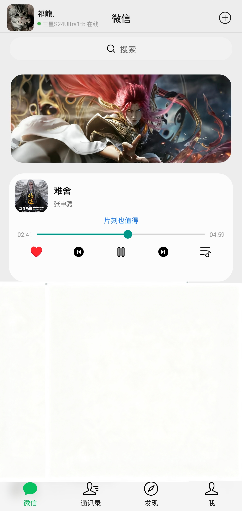
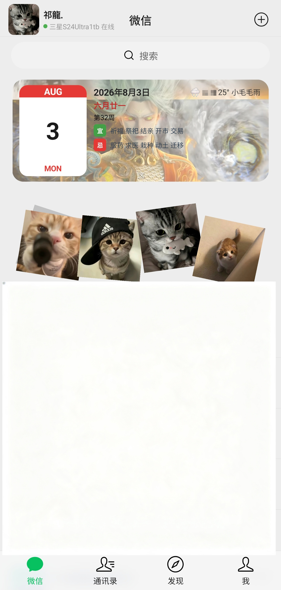
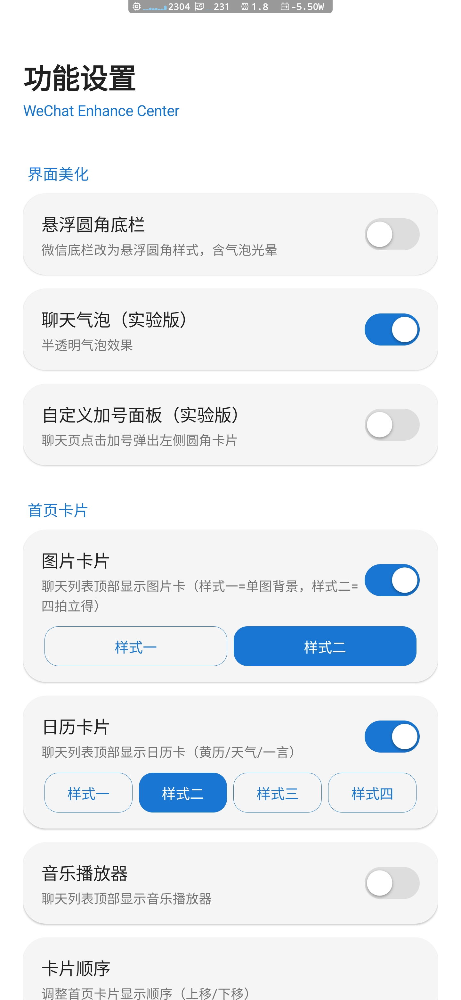

# Wex — 微信美化模块

基于 **LSPosed/Xposed** 的微信（com.tencent.mm）UI 美化与增强模块。

> ⚠️ 本模块仅供学习交流使用，请遵守当地法律法规与微信用户协议，使用风险自负。

## ✨ 功能特性

- 🎨 **底栏悬浮圆角美化** — 悬浮圆角底栏 + 气泡光晕
- 🏠 **首页三卡** — 日历卡（黄历/天气/一言）、图片卡、音乐卡
- 🎵 **音乐播放器** — QQ/网易云搜索播放、歌词、历史收藏、播放模式
- 🎤 **悬浮歌词** — 桌面悬浮显示歌词
- 🎧 **媒体通知控制** — 锁屏/通知栏上一首/暂停/下一首
- ⏱️ **定时关闭** — 15/30/自定义分钟
- 📌 **顶栏全自定义** — 头像/昵称/状态/标题/搜索框
- ➕ **加号菜单入口** — 聊天页快捷进入设置
- 📷 **相册选图换背景** — 卡片背景自定义

## 📱 界面预览







## 📲 安装使用

1. 安装 [LSPosed](https://github.com/LSPosed/LSPosed) 框架（需 Root）
2. 安装本模块 APK，在 LSPosed 中启用
3. 勾选作用域：**微信（com.tencent.mm）**
4. 重启微信，在「+ → WEX 设置」中配置功能

> 推荐使用 **微信 8.0.76** 及以上版本

## 🛠️ 自行构建

```bash
./gradlew :app:assembleRelease
```

## ⚖️ 开源协议

本项目基于 **GPL-3.0** 协议开源。

- 允许自由使用、修改、分发
- **衍生作品必须开源**，禁止闭源二改分发
- 请保留原作者署名
- 违反协议的行为将被追究（详见仓库 LICENSE 文件）

## ⛔ 禁止

- 禁止将本模块（含二改版本）用于商业盈利
- 禁止二改后闭源分发
- 禁止去除/修改版权信息

---

**仓库**：https://github.com/Ql1121/Wex